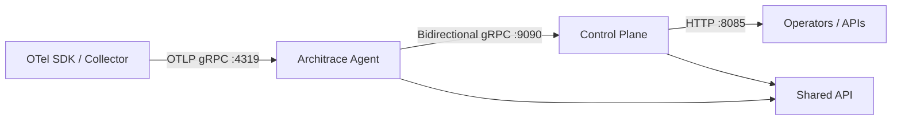

<div align="center">
  <h1>Architrace</h1>

  <p align="center">
    <strong>Runtime architecture intelligence for distributed systems</strong>
    <br/>
    Collect OTLP traces, build service graphs, and stream topology to a control plane
    <br/><br/>
  </p>

  
  
  

  [Quick Start](#-quick-start) | [Docker Demo](#-docker-demo) | [Contributing](#-contributing)
</div>

---

## Quick Start

Run quality gates + tests:

```bash
./gradlew spotlessCheck classes test jacocoTestReport
```

Build all modules:

```bash
./gradlew build
```

Run control-plane locally:

```bash
./gradlew :control-plane:bootRun
```

Build runnable agent fat jar:

```bash
./gradlew :agent:shadowJar
```

---

## Features

- **OTLP Ingestion** - Receives traces on OTLP gRPC (`:4319`)
- **Graph Transformation** - Converts spans into nodes/edges and graph batches
- **Control Plane Stream** - Bidirectional gRPC session between agent and control-plane
- **Structured Concurrency** - Runtime built on Java 25 concurrency primitives
- **Modular Monorepo** - Separate modules for runtime agent, control-plane, and shared API contracts

---

## Monorepo Structure

- **[`architrace-agent`](./architrace-agent)** - Runtime agent CLI, OTLP receiver, graph pipeline
- **[`architrace-control-plane`](./architrace-control-plane)** - Spring Boot service (HTTP + gRPC)
- **[`architrace-api`](./architrace-api)** - Shared protobuf contracts and generated classes
- **[`otel-test-app`](./otel-test-app)** - End-to-end demo stack (Python services + collector + Architrace)

---

## Architecture



---

## Docker Demo

Run full local demo stack:

```bash
cd otel-test-app
docker compose build
docker compose up -d
```

Traffic generator endpoint:

```bash
curl http://localhost:8080/
```

Expected response:

```text
A -> B -> C
```

---

## Common Commands

Format all modules:

```bash
./gradlew spotlessApply
```

Run only agent tests:

```bash
./gradlew :agent:test
```

Run only control-plane tests:

```bash
./gradlew :control-plane:test
```

Generate protobuf classes:

```bash
./gradlew :agent:generateProto :control-plane:generateProto :api:generateProto
```

---

## CI

PR workflow: [`/.github/workflows/pr-ci.yml`](./.github/workflows/pr-ci.yml)

Pipeline includes:

- Spotless check
- Compile
- Unit/integration tests
- Jacoco coverage
- Sonar (if `SONAR_TOKEN` is configured)
- Snyk (if `SNYK_TOKEN` is configured)

---

## Contributing

Contributions are welcome. Open an issue or submit a pull request with a clear scope and test coverage for behavior changes.

---

## License

Apache-2.0. See [LICENSE](./LICENSE).
