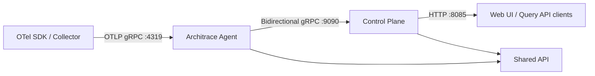

<div align="center">
  <h1>Architrace</h1>

  <p align="center">
    <strong>Runtime architecture intelligence for distributed systems</strong>
    <br/>
    Collect OTLP traces, build service graphs, and stream topology to a control plane
    <br/><br/>
  </p>

  
  
  

  [Documentation](https://architrace-intelligence.github.io/Architrace/) | [Quick Start](#quick-start) | [Docker Demo](#docker-demo) | [Contributing](#contributing)
</div>

---

## Quick Start

Run the quality gates (formatting, Checkstyle, tests with coverage, UI gate):

```bash
./gradlew spotlessApply check
```

Build all modules:

```bash
./gradlew build
```

Run control-plane locally:

```bash
./gradlew :architrace-control-plane:bootRun
```

Build runnable agent fat jar, validate a configuration, run the agent:

```bash
./gradlew :architrace-agent:shadowJar
java --enable-preview -jar architrace-agent/build/libs/architrace-agent-*-all.jar dry-run --config ./otel-test-app/architrace-agent.yaml
java --enable-preview -jar architrace-agent/build/libs/architrace-agent-*-all.jar run --config ./otel-test-app/architrace-agent.yaml --prop otlp.port=4320
```

Print the version the build computes from git tags and Conventional Commits:

```bash
./gradlew printVersion printReleaseVersion
```

---

## Features

- **OTLP Ingestion** - Receives traces on OTLP gRPC (`:4319`) from collectors and SDKs; service identity, deployment and peers come from the standard OpenTelemetry semantic conventions (current and legacy keys), with a configurable attribute mapping
- **Graph Transformation** - Converts spans into nodes/edges and graph batches
- **Control Plane Stream** - Bidirectional gRPC session between agent and control-plane with registration, heartbeats, acknowledged snapshots and automatic reconnection
- **Agent Metrics** - Prometheus `/metrics` and `/health` on port `9464`, rate-limited reporting of rejected and evicted spans
- **Query API** - REST under `/api/v1` from an OpenAPI 3.1 contract: scopes, agents, the graph and services of a scope at a point in time, snapshot history; Swagger UI at `/swagger-ui`
- **Web UI** - React + TypeScript single-page application served by the control plane at `/`, talking to the Query API through a client typed from the same contract: a Projects list filtered by environment and cluster, and the Service map of a scope (React Flow with an ELK layered layout)
- **Structured Concurrency** - Runtime built on Java 25 concurrency primitives
- **Modular Monorepo** - Separate modules for runtime agent, control-plane, shared API contracts and the UI, with shared build conventions in `build-logic`
- **Versioned from git** - the version is computed from the last `v*` tag and the Conventional Commits since it; the CLI reports it from the jar manifest

---

## Monorepo Structure

- **[`architrace-agent`](./architrace-agent)** - Runtime agent CLI, OTLP receiver, graph pipeline
- **[`architrace-control-plane`](./architrace-control-plane)** - Spring Boot service (HTTP + gRPC)
- **[`architrace-api`](./architrace-api)** - Shared protobuf and OpenAPI contracts and generated classes
- **[`architrace-ui`](./architrace-ui)** - Web UI (Vite, React, TypeScript), built by Gradle and bundled into the control plane jar
- **[`build-logic`](./build-logic)** - Gradle convention plugins: Java toolchain and quality gates, Spring Boot defaults, versioning from git
- **[`otel-test-app`](./otel-test-app)** - End-to-end demo stack (Python services + collector + Architrace)

---

## Architecture


```mermaid
flowchart LR
  OTel[OTel SDK / Collector] -->|OTLP gRPC :4319| Agent[Architrace Agent]
  Agent -->|Bidirectional gRPC :9090| CP[Control Plane]
  CP -->|HTTP :8085| UI[Web UI / Query API clients]
  Agent --> API[Shared API]
  CP --> API
```

---

## Docker Demo

Run full local demo stack:

```bash
cd otel-test-app
docker compose build
docker compose up -d
```

Traffic generator endpoint:

```bash
curl http://localhost:8080/
```

Expected response:

```text
A -> B -> C
```

---

## Common Commands

Format all modules:

```bash
./gradlew spotlessApply
```

Run only agent tests:

```bash
./gradlew :architrace-agent:test
```

Run only control-plane tests:

```bash
./gradlew :architrace-control-plane:test
```

Generate protobuf classes:

```bash
./gradlew :architrace-agent:generateProto :architrace-control-plane:generateProto :architrace-api:generateProto
```

Run the UI quality gate (types, lint, formatting, tests) or build its bundle; Gradle downloads the
pinned Node.js on first use:

```bash
./gradlew :architrace-ui:test
./gradlew :architrace-ui:npmBuild
```

Develop the UI against a running control plane (Node.js 22.12+, requests to `/api` are proxied
to `localhost:8085`):

```bash
cd architrace-ui
npm ci
npm run dev
```

---

## CI

Pull requests run [`PR`](./.github/workflows/pr.yml): `build` (`./gradlew build`: Spotless,
Checkstyle, tests with the JaCoCo coverage gate, the UI gate, jars), `quality` (SonarCloud with
the quality gate on new code), `security` (Snyk, OWASP Dependency-Check, gitleaks) and `docs`
(site build). [`PR title`](./.github/workflows/pr-title.yml) checks the title convention and
[`CodeQL`](./.github/workflows/codeql.yml) analyses the Java and TypeScript sources and the
workflows. Merges to `main` run [`Main`](./.github/workflows/main.yml): the same gates, then a
release when the commits since the last tag contain a releasing type (tag, notes, jars), the
container images, the documentation site and the dependency graph. The `main` ruleset
([`.github/rulesets/main.json`](./.github/rulesets/main.json)) makes those checks, resolved review
threads and a squash merge mandatory, and CodeRabbit ([`.coderabbit.yaml`](./.coderabbit.yaml))
reviews every pull request. Details on the
[M0 page](https://architrace-intelligence.github.io/Architrace/project/features/m0-engineering-platform/).

## Container images

Every merge to `main` publishes `ghcr.io/architrace-intelligence/architrace-agent` and
`ghcr.io/architrace-intelligence/architrace-control-plane` tagged `sha-<short>`; releases add
`X.Y.Z` and `latest`. The images run as a non-root user on Eclipse Temurin 25 JRE.

```bash
docker run --rm -p 8085:8085 -p 9090:9090 \
  -e ARCHITRACE_DB_URL=jdbc:postgresql://db:5432/architrace \
  ghcr.io/architrace-intelligence/architrace-control-plane:latest

docker run --rm -p 4317:4317 -v $PWD/architrace-agent.yaml:/config/architrace-agent.yaml \
  ghcr.io/architrace-intelligence/architrace-agent:latest
```

To build an image locally, produce a fresh jar first (`./gradlew clean assemble`), then
`docker build -t architrace-agent architrace-agent` or the same for `architrace-control-plane`.

---

## Contributing

Every change goes through a pull request with automated checks and review. Read
[CONTRIBUTING.md](./CONTRIBUTING.md) and the
[documentation site](https://architrace-intelligence.github.io/Architrace/) for the process,
the agreed requirements and the current state of the work.

---

## License

Apache-2.0. See [LICENSE](./LICENSE).
