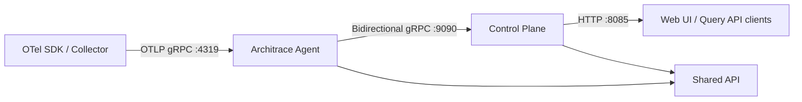

<div align="center">
  <h1>Architrace</h1>

  <p align="center">
    <strong>Runtime architecture intelligence for distributed systems</strong>
    <br/>
    Collect OTLP traces, build service graphs, and stream topology to a control plane
    <br/><br/>
  </p>

  
  
  

  [Documentation](https://architrace-intelligence.github.io/Architrace/) | [Quick Start](#quick-start) | [Docker Demo](#docker-demo) | [Contributing](#contributing)
</div>

---

## Quick Start

Run quality gates + tests:

```bash
./gradlew spotlessCheck classes test jacocoTestReport
```

Build all modules:

```bash
./gradlew build
```

Run control-plane locally:

```bash
./gradlew :control-plane:bootRun
```

Build runnable agent fat jar:

```bash
./gradlew :agent:shadowJar
```

---

## Features

- **OTLP Ingestion** - Receives traces on OTLP gRPC (`:4319`)
- **Graph Transformation** - Converts spans into nodes/edges and graph batches
- **Control Plane Stream** - Bidirectional gRPC session between agent and control-plane
- **Query API** - REST under `/api/v1` from an OpenAPI 3.1 contract: scopes, agents, the graph and services of a scope at a point in time, snapshot history; Swagger UI at `/swagger-ui`
- **Web UI** - React + TypeScript single-page application served by the control plane at `/`, talking to the Query API through a client typed from the same contract
- **Structured Concurrency** - Runtime built on Java 25 concurrency primitives
- **Modular Monorepo** - Separate modules for runtime agent, control-plane, and shared API contracts

---

## Monorepo Structure

- **[`architrace-agent`](./architrace-agent)** - Runtime agent CLI, OTLP receiver, graph pipeline
- **[`architrace-control-plane`](./architrace-control-plane)** - Spring Boot service (HTTP + gRPC)
- **[`architrace-api`](./architrace-api)** - Shared protobuf and OpenAPI contracts and generated classes
- **[`architrace-ui`](./architrace-ui)** - Web UI (Vite, React, TypeScript), built by Gradle and bundled into the control plane jar
- **[`otel-test-app`](./otel-test-app)** - End-to-end demo stack (Python services + collector + Architrace)

---

## Architecture


```mermaid
flowchart LR
  OTel[OTel SDK / Collector] -->|OTLP gRPC :4319| Agent[Architrace Agent]
  Agent -->|Bidirectional gRPC :9090| CP[Control Plane]
  CP -->|HTTP :8085| UI[Web UI / Query API clients]
  Agent --> API[Shared API]
  CP --> API
```

---

## Docker Demo

Run full local demo stack:

```bash
cd otel-test-app
docker compose build
docker compose up -d
```

Traffic generator endpoint:

```bash
curl http://localhost:8080/
```

Expected response:

```text
A -> B -> C
```

---

## Common Commands

Format all modules:

```bash
./gradlew spotlessApply
```

Run only agent tests:

```bash
./gradlew :agent:test
```

Run only control-plane tests:

```bash
./gradlew :control-plane:test
```

Generate protobuf classes:

```bash
./gradlew :agent:generateProto :control-plane:generateProto :api:generateProto
```

Run the UI quality gate (types, lint, formatting, tests) or build its bundle; Gradle downloads the
pinned Node.js on first use:

```bash
./gradlew :ui:test
./gradlew :ui:npmBuild
```

Develop the UI against a running control plane (Node.js 22.12+, requests to `/api` are proxied
to `localhost:8085`):

```bash
cd architrace-ui
npm ci
npm run dev
```

---

## CI

Pull requests run [`PR Checks`](./.github/workflows/agent.yml): Spotless, compilation, tests with
JaCoCo coverage, the UI gate (`:ui:test`), SonarCloud analysis and a jar build. Merges to `main` run
[`Merge CI/CD`](./.github/workflows/ci-cd.yml), which adds Snyk monitoring and publishes release
artifacts on `v*` tags. Both pipelines are being replaced by the gated flow described in the
[M0 design](https://architrace-intelligence.github.io/Architrace/project/features/m0-engineering-platform/).

---

## Contributing

Every change goes through a pull request with automated checks and review. Read
[CONTRIBUTING.md](./CONTRIBUTING.md) and the
[documentation site](https://architrace-intelligence.github.io/Architrace/) for the process,
the agreed requirements and the current state of the work.

---

## License

Apache-2.0. See [LICENSE](./LICENSE).
