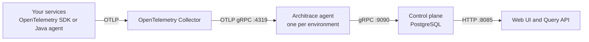

<div align="center">
  <h1>Architrace</h1>

  <p align="center">
    <strong>Runtime architecture intelligence for distributed systems</strong>
    <br/>
    Collect OTLP traces, build service graphs, and stream topology to a control plane
    <br/><br/>
  </p>

  [](https://github.com/Architrace-Intelligence/Architrace/actions/workflows/main.yml)
  [](https://github.com/Architrace-Intelligence/Architrace/actions/workflows/codeql.yml)
  [](https://github.com/Architrace-Intelligence/Architrace/actions/workflows/main.yml)
  [](https://sonarcloud.io/summary/overall?id=Architrace-Intelligence_Architrace-agent)
  [](https://sonarcloud.io/component_measures?id=Architrace-Intelligence_Architrace-agent&metric=coverage)
  [](https://snyk.io/test/github/Architrace-Intelligence/Architrace)

  [](https://github.com/Architrace-Intelligence/Architrace/releases)
  [](https://github.com/Architrace-Intelligence/Architrace/commits/main)
  [](https://github.com/orgs/Architrace-Intelligence/packages?repo_name=Architrace)
  [](./LICENSE)

  [](./gradle.properties)
  [](./gradle/wrapper/gradle-wrapper.properties)
  [](./gradle/libs.versions.toml)
  [](./gradle.properties)
  [](./architrace-ui/package.json)
  [](./architrace-ui/package.json)
  [](./architrace-ui/package.json)

  [Documentation](https://architrace-intelligence.github.io/Architrace/) | [Try the demo](#try-it-in-two-minutes) | [Install in production](#install-in-production) | [Connect your services](#connect-your-services) | [Develop](#develop) | [Contributing](#contributing)
</div>

---

Architrace shows the **runtime architecture of your system as it actually is**: which services
talk to which, over HTTP or through which topics, which databases they share, which external
hosts they depend on, how that differs between environments and releases, and where the
structure violates rules you care about. It needs no code change: your services send
OpenTelemetry traces, as most of them already do, and Architrace builds the picture from the
spans.

What you get:

- **Service map** per project, environment and cluster: services, databases, topics and
  external hosts with calls, errors and latency percentiles on every edge.
- **Drift** between two environments or two points in time: versions, deployments and
  dependencies that were added, removed or changed.
- **Architecture findings** from eight deterministic rules (cyclic dependency, shared
  database, wide blast radius, cross-domain coupling, fan-in hub, long synchronous chain,
  unknown external, data stream without producer) with the evidence behind each one.
- **Query API** (OpenAPI 3.1, `/api/v1`) for everything the UI shows, so scripts and CI jobs can
  ask the same questions.

## How it works


```mermaid
flowchart LR
  Services[Your services<br/>OpenTelemetry SDK or Java agent] -->|OTLP| Collector[OpenTelemetry Collector]
  Collector -->|OTLP gRPC :4319| Agent[Architrace agent<br/>one per environment]
  Agent -->|gRPC :9090| CP[Control plane<br/>PostgreSQL]
  CP -->|HTTP :8085| UI[Web UI and Query API]
```

1. The **agent** receives the traces of one environment, pairs client and server spans into a
   service graph and publishes one snapshot per minute. It keeps the current window in memory
   and nothing else.
2. The **control plane** stores the snapshots, evaluates the rules, and serves the Query API
   and the UI from one port.
3. Your **collector** forwards traces to the agent next to your tracing backend; Architrace is
   one more destination, not a replacement.

## Try it in two minutes

The demo runs two environments of a small shop, a broker, a database and an external host on
the published images, with a drift between the environments and findings out of the box:

```bash
cd demo
docker compose up -d
```

Open <http://localhost:8085>. The Projects list shows the project `demo` with the scopes `DEV`
and `STAGE` within a minute; the map, the Drift screen and the Findings screen have something
to show from the first snapshot on. What runs and what to click first is in the
[Docker demo guide](https://architrace-intelligence.github.io/Architrace/guides/docker-demo/).
Stop it with `docker compose down -v`.

## Install in production

Three things: a PostgreSQL database, one control plane and one agent per environment (one
per project, environment and cluster, to be exact). The
[installation guide](https://architrace-intelligence.github.io/Architrace/guides/deployment/)
walks through it step by step with Docker and Kubernetes examples, sizing, security and
upgrades. In short:

1. Create a PostgreSQL 15+ database and a user that owns it.
2. Run `ghcr.io/architrace-intelligence/architrace-control-plane` with `ARCHITRACE_DB_URL`,
   `ARCHITRACE_DB_USERNAME` and `ARCHITRACE_DB_PASSWORD`; give it 1 GiB; put port `8085` behind
   your reverse proxy with authentication.
3. Run `ghcr.io/architrace-intelligence/architrace-agent` once per environment with a small YAML
   file (`project`, `environment`, `cluster`, `agent.name`, `control-plane.server`); give it
   512 MiB.
4. Add an OTLP/gRPC exporter to the collector of each environment pointing at its agent on
   port `4319`, and stamp `deployment.environment.name` there.
5. Open the UI: the scope appears within a minute, the map fills with the first traffic.

The images are public, pinned to one `X.Y.Z` tag per release, run as a non-root user on
Eclipse Temurin 25 JRE, size their heap from the container memory limit and carry a health
check:

```bash
docker pull ghcr.io/architrace-intelligence/architrace-control-plane:0.6.0
docker pull ghcr.io/architrace-intelligence/architrace-agent:0.6.0
```

Every setting is on the
[configuration reference](https://architrace-intelligence.github.io/Architrace/reference/configuration/).

## Connect your services

Architrace reads traces only, so the instrumentation decides what appears on the map. Nothing
in the code changes: attach the **OpenTelemetry Java agent** with `JAVA_TOOL_OPTIONS`, or add
the **Spring Boot starter** and configure it through properties, then set a handful of `OTEL_*`
variables (`OTEL_EXPORTER_OTLP_PROTOCOL=grpc`, the service name, namespace and version). The
[instrumentation guide](https://architrace-intelligence.github.io/Architrace/guides/instrumenting-services/)
compares the two options, lists the attributes Architrace keys on, and covers sampling, the
rollout order and the usual gaps (Kafka Streams, Redis and OkHttp need the Java agent).

## Features

| Area | What it does |
|------|--------------|
| OTLP ingestion | OTLP/gRPC receiver on `4319`; service identity, deployment and peers from the OpenTelemetry semantic conventions, current and legacy keys, with a configurable attribute mapping |
| Graph pipeline | pairs client and server spans into service, database, topic and external nodes with sync, publish and consume edges; latency histogram in microseconds; bounded queues, pending TTL, internal topics ignored by pattern |
| Agent to control plane | bidirectional gRPC session with registration, heartbeats, acknowledged snapshots and automatic reconnection; a bounded snapshot queue bridges control plane restarts |
| Agent metrics | Prometheus `/metrics` and `/health` on `9464`; every loss is counted and logged |
| Storage | PostgreSQL with Liquibase migrations; retention job; one scope per project, environment and cluster |
| Architecture rules | eight deterministic rules evaluated after every snapshot, thresholds configurable, findings with subject and evidence |
| Query API | REST under `/api/v1` from an OpenAPI 3.1 contract: scopes, agents, graph, services, snapshot history, drift, findings, blast radius; Swagger UI at `/swagger-ui` |
| Web UI | React and TypeScript single-page application served by the control plane: Projects list, service map with lenses and context panel, Drift screen, Findings screen |
| Runtime | Java 25, structured concurrency, picocli CLI with `run`, `dry-run` and `version` |
| Delivery | version computed from git tags and Conventional Commits; images and release on every merge |

## Develop

Prerequisites: JDK 25 (Gradle downloads the pinned Node.js for the UI). Everything runs
through the Gradle wrapper.

```bash
./gradlew spotlessApply check            # format, Checkstyle, tests with coverage, UI gate
./gradlew build                          # all modules and jars
./gradlew :architrace-control-plane:bootRun
./gradlew :architrace-agent:shadowJar
java --enable-preview -jar architrace-agent/build/libs/architrace-agent-*-all.jar dry-run --config ./demo/agent-dev.yaml
java --enable-preview -jar architrace-agent/build/libs/architrace-agent-*-all.jar run --config ./demo/agent-dev.yaml --prop control-plane.server=localhost:9090
./gradlew printVersion printReleaseVersion
```

UI against a running control plane (Node.js 22.12+; `/api` is proxied to `localhost:8085`):

```bash
cd architrace-ui && npm ci && npm run dev
```

More in the
[local development guide](https://architrace-intelligence.github.io/Architrace/guides/local-development/).

### Repository layout

| Module | Contents |
|--------|----------|
| [`architrace-agent`](./architrace-agent) | agent CLI, OTLP receiver, graph pipeline, publisher |
| [`architrace-control-plane`](./architrace-control-plane) | Spring Boot service: gRPC ingestion, storage, rules, Query API, UI bundle |
| [`architrace-api`](./architrace-api) | protobuf and OpenAPI contracts, generated classes |
| [`architrace-ui`](./architrace-ui) | React and TypeScript UI, built by Gradle and packed into the control plane |
| [`build-logic`](./build-logic) | Gradle convention plugins: toolchain, quality gates, Spring Boot defaults, versioning |
| [`demo`](./demo) | the two-environment demo stack |
| [`documentation`](./documentation) | the documentation site (Astro Starlight) |

### CI and releases

Every pull request runs the quality gates ([`PR`](./.github/workflows/pr.yml): build with
Spotless, Checkstyle, tests and coverage, the UI gate; SonarCloud; Snyk, OWASP Dependency-Check
and gitleaks; the site build), the title check and CodeQL, and CodeRabbit reviews it. The
`main` ruleset requires the checks, resolved review threads and a squash merge. Every merge to
`main` runs the same gates, then tags a release when the commits since the last tag contain a
releasing type, publishes the jars, the images (`X.Y.Z`, `latest`, `sha-<short>`) and the
documentation site. Details on the
[M0 page](https://architrace-intelligence.github.io/Architrace/project/features/m0-engineering-platform/).

---

## Contributing

Every change goes through a pull request with automated checks and review. Read
[CONTRIBUTING.md](./CONTRIBUTING.md) and the
[documentation site](https://architrace-intelligence.github.io/Architrace/) for the process,
the agreed requirements and the current state of the work.

---

## License

Apache-2.0. See [LICENSE](./LICENSE).
