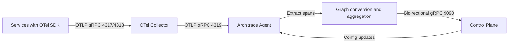

## Runtime flow

## Agent pipeline

1. `run --config ...` loads YAML and validates required fields.
2. Agent starts OTLP trace receiver.
3. Agent opens control-plane stream and registers itself.
4. Received traces are converted into internal graph representation.
5. Graph batches are sent to control-plane when a lifecycle is active.

## Control-plane behavior

- Runs as Spring Boot app.
- Exposes gRPC `ControlPlaneService` for agent stream and health checks.
- Sends `ConfigUpdate` commands back to connected agents.

## Intelligence model

Architrace maps span/resource attributes into architecture entities:

- Logical service nodes (`environment`, `domain`, `service`).
- Service dependency edges (`source`, `target`, `operation`, `call_count`).
- Deployment context from resource attributes (`cluster`, `namespace`).
