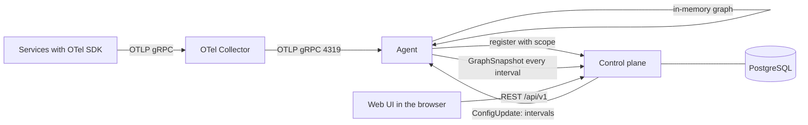
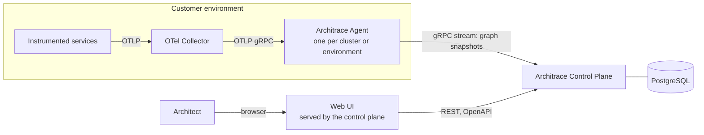
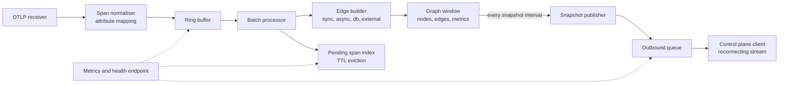
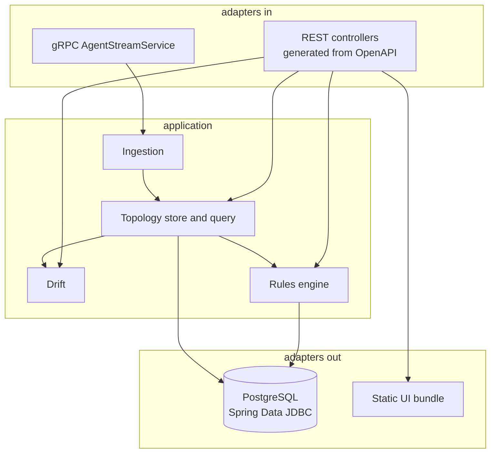
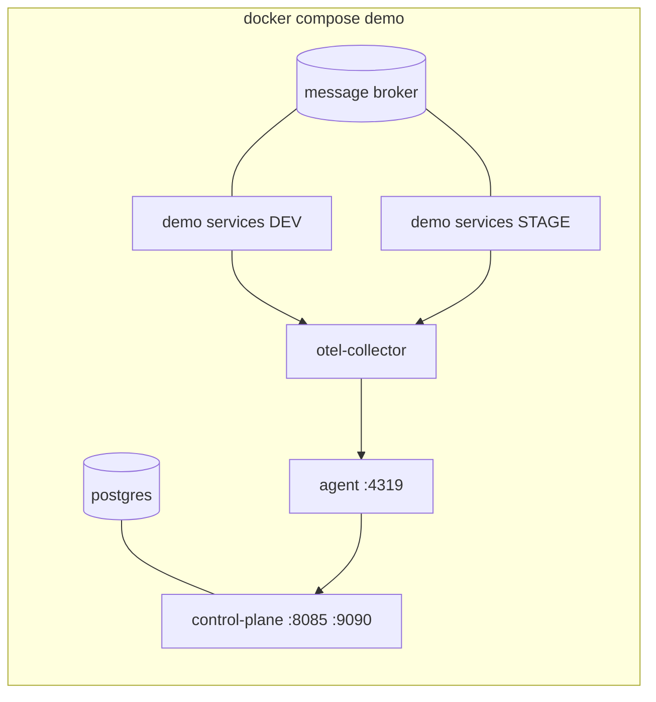

This page is the living description of the system. "Current" is what runs on `main`; "Target"
is the agreed MVP design. Every implementation PR that changes structure moves content from
Target to Current.

## Principles

- **Telemetry in, intelligence out.** Architrace never stores raw spans. The agent reduces
  traces to a graph; the control plane stores graphs and derives views from them.
- **Thin agent, rich control plane.** The agent is a single process with bounded memory and no
  external dependencies. All history, comparison and rules live in the control plane.
- **Contracts first.** The agent ↔ control plane protobuf and the Query API OpenAPI document
  are the only coupling between components; UI and scripts see the same API.
- **Data-oriented code.** Domain data are immutable records and sealed types; behaviour lives
  in small services that transform them. No framework types leak into domain packages.
- **Standard OpenTelemetry.** Identity and context come from OTel semantic conventions, with
  configurable fallbacks for legacy attribute names.

## Current state (as of 2026-10-05)

```mermaid
flowchart LR
  App[Services with OTel SDK] -->|OTLP gRPC| Collector[OTel Collector]
  Collector -->|OTLP gRPC 4319| Agent[Agent]
  Agent -->|in-memory graph| Agent
  Agent -->|register with scope| CP[Control plane]
  Agent -->|GraphSnapshot every interval| CP
  CP -->|ConfigUpdate: intervals| Agent
  CP --- DB[(PostgreSQL)]
  Browser[Web UI in the browser] -->|REST /api/v1| CP
```

- The agent receives OTLP traces and normalises every span into a `SpanRecord` (identity,
  deployment and a sealed peer resolved through a configurable attribute mapping that covers
  the current and the legacy semantic conventions), builds nodes and edges in memory and keeps
  then builds the graph on a single worker thread fed by a bounded queue: nodes with ADR 0007
  ids, sync edges paired through a pending index with TTL, database, topic and external edges,
  per-window metrics with a logarithmic latency histogram, frozen into an immutable
  `GraphSnapshot` every interval. Snapshots go through a bounded queue to a control plane
  session that registers the agent with its scope (project, environment, cluster), publishes,
  heartbeats and reconnects after `control-plane.retry-seconds`. Prometheus metrics and a
  health document are served on `metrics.port`; losses are reported in rate-limited log
  lines. Its configuration v2 is validated as a whole, printed by `dry-run` and overridable
  with `--prop`. Still missing: the formatter switch and the last cleanup (M1, PR 5).
- The control plane registers agents, validates and stores `GraphSnapshot` messages in
  PostgreSQL (agents, snapshots, nodes, edges; Liquibase), answers with acknowledgements and
  tracks liveness through heartbeats. `TopologyQuery` answers the current graph of a scope at
  a point in time (latest snapshot per agent, merged), the services of that graph with their
  dependencies, a per-scope summary for the Projects list and the paged snapshot history; a
  scheduled job removes snapshots older than the retention period. The `drift` package
  compares two such graphs: `GraphDiffer` is a pure set difference on node ids and edge keys
  with a mode-dependent notion of a changed node, `DriftQuery` resolves the two sides (two
  scopes of a project at one instant, or one scope at two instants). The `rules` package
  turns such a graph into findings: `RuleEngine` runs the sealed `ArchitectureRule` set,
  built from `RulesProperties` (`CyclicDependency` over the strongly connected components
  of the sync edges, `SharedDatabase` with a client threshold, `UnknownExternal` against an
  allowlist), and orders the `Finding` records by severity, rule and subject; the
  remaining rules, the impact analysis, evaluation after ingestion, storage and the
  findings endpoint follow in the next M6 pull requests. The Query API under
  `/api/v1` exposes scopes, agents, graph, services, snapshot history, single snapshots and
  the two diffs of a scope, with domain errors as typed RFC 9457 problems; the control plane
  serves its OpenAPI document and Swagger UI. Health and metrics are on Actuator.
- The UI module `architrace-ui` (Vite, React, TypeScript) is built by Gradle, which downloads
  the pinned Node.js, and its bundle is packed into the control plane jar under `static/`. The
  control plane serves it at `/` with a single-page fallback: unknown paths outside `/api`,
  `/actuator`, `/swagger-ui` and `/webjars` whose last segment has no extension answer
  `index.html`; everything else keeps its 404. The client is typed from the OpenAPI document
  (`openapi-typescript`, `openapi-fetch`) with TanStack Query for server state. The initial release
  has three screens: the Projects list (scopes filtered by environment and cluster, grouped,
  with the filter in the URL), the Service map of a scope, drawn with React Flow custom nodes
  on an ELK layered layout that is loaded on demand (M4), and the Drift screen of a scope
  (M5): environment or timeline mode, both sides in the URL, counters, a grouped list and the
  same map with drift overlays, fed by the two diff endpoints and the right side's graph.
- The build is governed by the convention plugins of the included build `build-logic`
  (`architrace.java`, `architrace.spring-boot`, `architrace.versioning`): one place for the
  toolchain, formatting, Checkstyle, coverage gates and versioning. Gradle project paths equal
  directory names. The version is computed from git tags and Conventional Commits
  ([ADR 0006](../project/adr/0006-versioning-and-release-flow/)) and reaches the CLI and the
  agent registration through the jar manifest.
- Details and defects: [Requirements §3](../project/requirements/#3-what-exists-today-inventory-of-main-2026-10-01).

## Target architecture (MVP)

### System context

```mermaid
flowchart LR
  subgraph Customer environment
    Svc[Instrumented services] -->|OTLP| Col[OTel Collector]
    Col -->|OTLP gRPC| Agent[Architrace Agent<br/>one per cluster or environment]
  end
  Agent -->|gRPC stream: graph snapshots| CP[Architrace Control Plane]
  CP --- DB[(PostgreSQL)]
  Arch[Architect] -->|browser| UI[Web UI<br/>served by the control plane]
  UI -->|REST, OpenAPI| CP
```

| Container | Technology | Responsibility | Ports |
|-----------|------------|----------------|-------|
| Agent | Java 25, picocli, Guice, gRPC | OTLP in, graph snapshot out, local metrics | OTLP `4319`, metrics `9464` |
| Control plane | Java 25, Spring Boot, Spring gRPC, Spring Data JDBC, Liquibase | ingest, store, query, diff, rules, serve UI | HTTP `8085`, gRPC `9090` |
| UI | React, TypeScript, Vite | service map, drift, findings | bundled into the control plane |
| PostgreSQL | 16+ | snapshots, agents, findings | `5432` |

### Agent

```mermaid
flowchart LR
  OTLP[OTLP receiver] --> N[Span normaliser<br/>attribute mapping] --> RB[Ring buffer] --> B[Batch processor]
  B --> EB[Edge builder<br/>sync, async, db, external] --> W[Graph window<br/>nodes, edges, metrics]
  B --> P[Pending span index<br/>TTL eviction]
  W -->|every snapshot interval| S[Snapshot publisher] --> Q[Outbound queue] --> CPC[Control plane client<br/>reconnecting stream]
  M[Metrics and health endpoint] -.-> RB & P & Q
```

- Spans are normalised once into `SpanRecord` values: ids, kind, timing, error flag,
  `ServiceIdentity`, `Deployment` and a sealed `Peer` (HTTP, database, messaging, none).
- The edge builder pattern-matches on kind and peer. Topics and queues are nodes; producers
  publish to them and consumers consume from them.
- A window accumulates nodes and edges with call, error and latency metrics; every interval it
  is frozen into a `GraphBatch`, queued and streamed. The queue survives reconnects.
- Unmatched spans are evicted after a TTL; drops and evictions are metrics, never silent.
- Design detail: [M1 Agent pipeline completion](../project/features/m1-agent-pipeline/).

### Control plane

```mermaid
flowchart TB
  subgraph adapters in
    G[gRPC AgentStreamService]
    R[REST controllers<br/>generated from OpenAPI]
  end
  subgraph application
    I[Ingestion] --> T[Topology store and query]
    T --> D[Drift]
    T --> RU[Rules engine]
  end
  subgraph adapters out
    P[(PostgreSQL<br/>Spring Data JDBC)]
    ST[Static UI bundle]
  end
  G --> I
  R --> T & D & RU
  T --> P
  RU --> P
  R --> ST
```

Packages are organised by feature, each with the same inner shape:

| Package | Domain (records, sealed types) | Service (behaviour) | Adapters |
|---------|--------------------------------|---------------------|----------|
| `agents` | `Agent`, `AgentHealth` | registry, liveness | gRPC, repository |
| `ingestion` | `IncomingSnapshot` | validation, mapping to topology | gRPC |
| `topology` | `Scope`, `Snapshot`, `TopologyNode`, `TopologyEdge`, `Agent`, `NodeView`, `Page` | store, current graph, node views, history, retention | Spring Data JDBC (`topology.persistence`), REST (`topology.web`: controllers, model mapping, problem details) |
| `drift` | `GraphRef`, `NodeChange`, `TopologyDiff`, `DiffMode` | `GraphDiffer`, `DriftQuery` | REST (`drift.web`) |
| `rules` | `ArchitectureRule` (sealed: `CyclicDependency`, `SharedDatabase`, `UnknownExternal`), `Finding`, `RulesProperties` | `RuleEngine`; evaluation after ingest and impact analysis (next M6 PRs) | repository, REST (next M6 PRs) |
| `web` | | | OpenAPI document, Swagger UI, UI bundle with single-page fallback |

Design detail: [M2](../project/features/m2-control-plane-storage/), [M3](../project/features/m3-query-api/),
[M5](../project/features/m5-drift/), [M6](../project/features/m6-architecture-rules/).

### Topology model

| Concept | Identity | Notes |
|---------|----------|-------|
| Scope | project × environment × cluster | reported by the agent at registration; every snapshot belongs to one scope |
| Environment | name (`DEV`, `STAGE`, `PROD`, …) | from `deployment.environment.name` or the agent default |
| Service | `(domain, name)` | environment-independent key used for drift; `domain` from `service.namespace` |
| Service deployment | service + environment | versions seen, clusters, namespaces |
| Database | `(system, namespace)` | from `db.system`, `db.namespace` |
| Topic / queue | `(system, name)` | from `messaging.system`, `messaging.destination.name` |
| External service | address | from `server.address` when no server span matches |
| Edge | `(source, target, kind)` | kind is `sync`, `publish` or `consume`; metrics per window |
| Snapshot | `(agent, environment, window)` | immutable; the current graph is the union of the latest snapshot per agent |

Full rules: [ADR 0007](../project/adr/0007-topology-model/).

### Contracts

- **Agent ↔ control plane**: protobuf `architrace.controlplane.v1` in `architrace-api`.
  Bidirectional stream: agent sends `AgentRegister`, `GraphSnapshot`, `Heartbeat`; control
  plane sends `ConfigUpdate`, `SnapshotAck`, `SnapshotRejected`
  ([gRPC contract](../reference/grpc-contract/)).
- **Query API**: OpenAPI 3.1 document `architrace-api/src/main/resources/openapi/architrace-query-api.yaml`,
  served under `/api/v1` together with Swagger UI. The control plane build generates the server
  interfaces from it, the UI build the TypeScript client
  ([ADR 0008](../project/adr/0008-contract-first-apis/), [Query API](../reference/query-api/)).

### Cross-cutting

- **Configuration**: agent YAML file with CLI overrides; control plane Spring configuration
  with `ARCHITRACE_*` environment variables.
- **Observability**: Micrometer metrics and health in both components; Prometheus exposition.
- **Security (MVP)**: plaintext gRPC and HTTP inside a trusted network; TLS and authentication
  are post-MVP (C16). No secrets in configuration files.
- **Errors**: REST errors as RFC 9457 problem details; gRPC status codes with messages that
  never leak internals.

### Deployment view

```mermaid
flowchart LR
  subgraph docker compose demo
    PG[(postgres)] --- CP[control-plane :8085 :9090]
    AG[agent :4319] --> CP
    OC[otel-collector] --> AG
    S1[demo services DEV] --> OC
    S2[demo services STAGE] --> OC
    K[(message broker)] --- S1 & S2
  end
```

Container images for the agent and the control plane are published to GHCR by the main
pipeline. Kubernetes manifests and a Helm chart are post-MVP.

### Module layout

| Module | Type | Depends on | State |
|--------|------|------------|-------|
| `build-logic` | Gradle included build, convention plugins | | current |
| `architrace-api` | protobuf + OpenAPI + generated code | | current |
| `architrace-agent` | application | `architrace-api` | current |
| `architrace-control-plane` | Spring Boot application | `architrace-api`, UI bundle | current |
| `architrace-ui` | Vite project driven from Gradle | `architrace-api` (OpenAPI document) | current |
| `demo` | docker compose, sample services | published images | target (today `otel-test-app`) |

Rules: [ADR 0005](../project/adr/0005-module-layout/). Project paths equal directory names since
M0 PR 2.

## Maintenance

Update this page in the same PR as any change to modules, packages, contracts, data model or
deployment. Keep "Current state" truthful and move items out of "Target" as they land.
